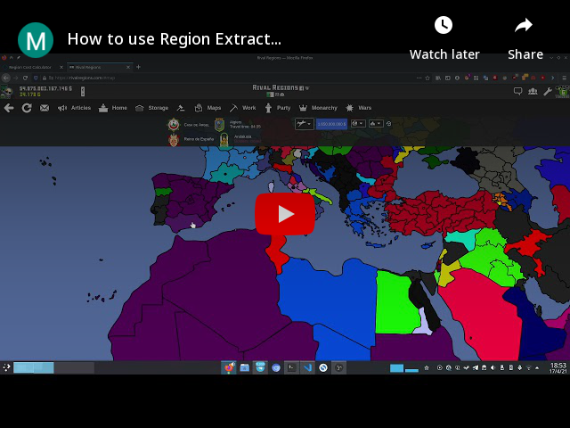

# Dmg extract tool

Script for rivalregions game that allows to extract both the individual and party damage of any front. It is meant to be used along with RR Tools [Dmg Tool](https:///rr-tools.eu/dmg-tool)

### How to use:

<iframe width="500" height="300" src="https://www.youtube.com/embed/wRw9q8HbFmo" frameborder="0" allowfullscreen></iframe>

### Installation

- Read [how to use user scripts for RR][guide].
- [Click  to install][raw].
- Check out my [RR script collection][scripts].

[guide]: https://rr-tools.eu/guide

[scripts]: https://rr-tools.eu/mods

[raw]: https://github.com/pbl0/rr-scripts/raw/main/scripts/dmg-extract/extract_dmg.user.js